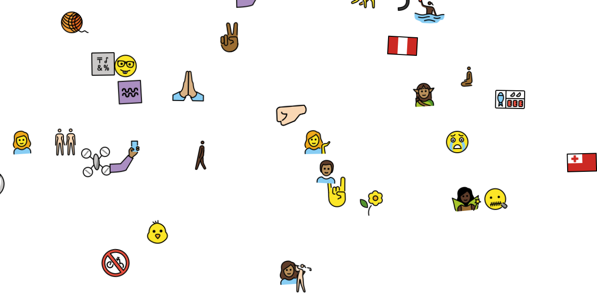

# mojifall-openmoji

A waterfall of emojis animated on html canvas: [demo.akselipalen.com/mojifall/](http://demo.akselipalen.com/mojifall/)

## See also

- A weighted version that mimics real-world emoji usage in Twitter: [github.com/axelpale/mojifall/tree/emojitracker](https://github.com/axelpale/mojifall/tree/emojitracker)
- [Unicode Emoji Chart](https://unicode.org/emoji/charts/full-emoji-list.html)

## License

Source code: [GNU General Public License v3.0 or later](https://spdx.org/licenses/GPL-3.0-or-later.html#licenseText)

OpenMoji images: [CC BY-SA 4.0](https://creativecommons.org/licenses/by-sa/4.0/)
